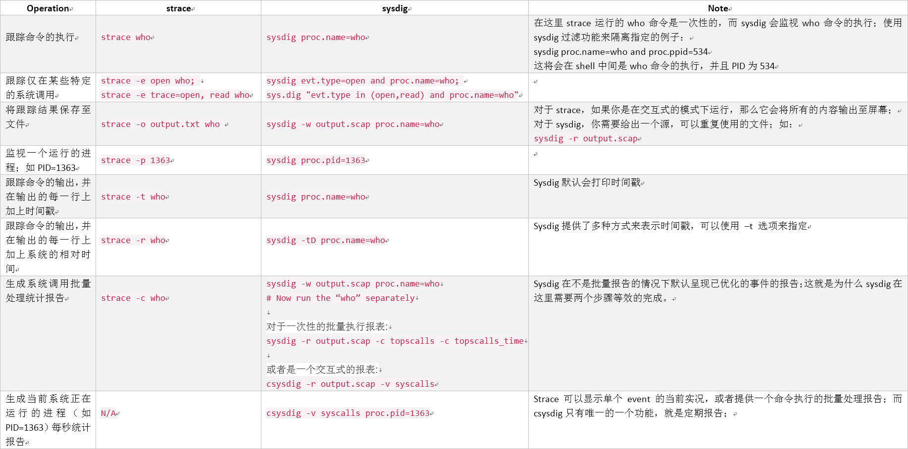
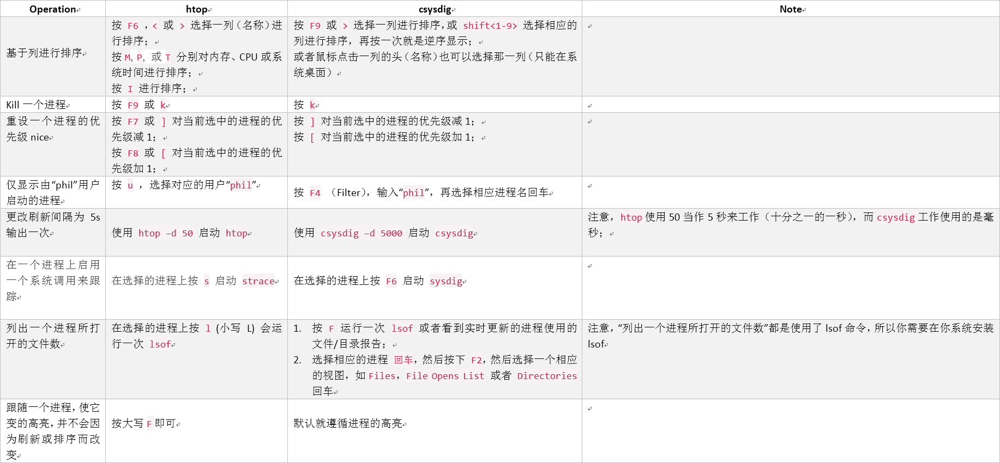
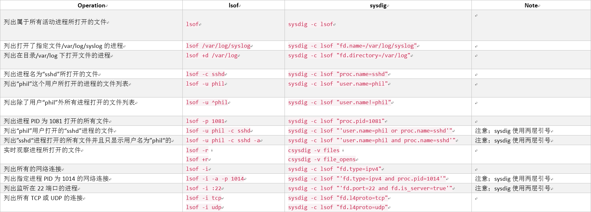
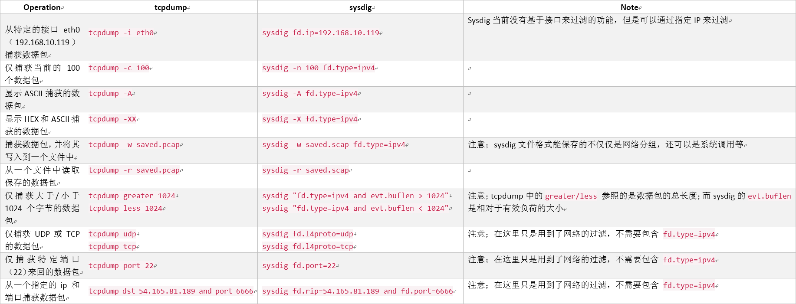
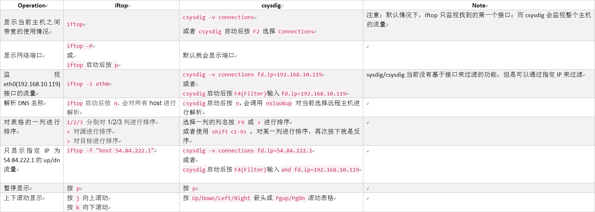

# Linux 故障排除速查表：starce，htop，lsof，tcpdump，iftop，sysdig
> 翻译至：https://sysdig.com/blog/linux-troubleshooting-cheatsheet/

> 这是一份Linux管理员故障排除的命令行速查表，对深入分析他们的服务器有很大的帮助；无论你是一个工作一个月的新手还是一个工作20年的高手，这里肯定会有一个你所钟爱的工具来帮助你解决问题。

### strace
> `strace`和`sysdig`之间有一个微妙的差异，特别是在许多并行的程序（环境）中比较明显，比如一些简单的`strace`例子中包括可执行的命令行和一次性的操作，表现非常突出；
而在其它方面，`sysdig`却有一个不同的理念，因为它发生的事件是实时监控的，它会在分析并捕获数据之前保存到一个文件中去。值得庆幸的是，`sysdig`提供了丰富
的过滤选项来监视一次性的操作，下面的你将会看到：



### htop
> `htop`是一个实时的、和交互式的工具，我们可以把它比作一个可实时交互的`csysdig`。对于初学者来说，这两种工具有着相同的使用导向，`上/下/左/右`箭头以及`PgUp`键和`PgDn`键。



### lsof



### tcpdump
> `tcpdump`完全集中于网络通信，而对于`sysdig`，网络流量只是它的一个子集。许多`tcpdump`的使用案列都涉及到过滤和使用特定网络`BPF`过滤器，而`sysdig`则使用自己的更为广泛的`sysdig`过滤功能；这两种方法看起来有许多的相似，但当你有更为苛刻的过滤功能的时候，你会想到这两者的区别。



### iftop
> iftop是一个可交互的工具，有点类似csysdig；



> 官方地址：https://sysdig.com/

### 查看线程或进程状态

> `ps`可以罗列当前系统的进程信息，常用的命令选项是`ps auxH`或者`ps XH pid`；其中大写的`H`可以打印出相关线程信息。

```shell
[root@web-162 ~]# ps XH 12196
  PID   STACKP      ESP      EIP TMOUT ALARM STAT TTY        TIME COMMAND
12196 ee88c270 ee889b38 f7edada0     -     - Dl+  pts/0     10:32 /usr/bin/python /usr/bin/fab -f tpbackup.py go
12196 ee88c270 3f8b91b0 f7edea63     -     - Sl+  pts/0      2:35 /usr/bin/python /usr/bin/fab -f tpbackup.py go
12196 ee88c270 3f7b81b0 f7edea63     -     - Sl+  pts/0      2:32 /usr/bin/python /usr/bin/fab -f tpbackup.py go
12196 ee88c270 3f6b71b0 f7edea63     -     - Sl+  pts/0      2:55 /usr/bin/python /usr/bin/fab -f tpbackup.py go
12196 ee88c270 3f4b51b0 f7edea63     -     - Sl+  pts/0      2:41 /usr/bin/python /usr/bin/fab -f tpbackup.py go
12196 ee88c270 3f2b31b0 f7edea63     -     - Sl+  pts/0      2:07 /usr/bin/python /usr/bin/fab -f tpbackup.py go
12196 ee88c270 3f3b41b0 f7edea63     -     - Sl+  pts/0      2:11 /usr/bin/python /usr/bin/fab -f tpbackup.py go
12196 ee88c270 3f5b61b0 f7edea63     -     - Sl+  pts/0      2:02 /usr/bin/python /usr/bin/fab -f tpbackup.py go
```

或者

```shell
[root@web-162 ~]# ps auxH | grep tpbackup
root     12196 22.5  0.8 1017764 68220 pts/0   Sl+  21:13  11:32 /usr/bin/python /usr/bin/fab -f tpbackup.py go
root     12196  5.0  0.8 1017764 68220 pts/0   Sl+  21:13   2:36 /usr/bin/python /usr/bin/fab -f tpbackup.py go
root     12196  5.7  0.8 1017764 68220 pts/0   Sl+  21:20   2:32 /usr/bin/python /usr/bin/fab -f tpbackup.py go
root     12196  7.8  0.8 1017764 68220 pts/0   Sl+  21:27   2:55 /usr/bin/python /usr/bin/fab -f tpbackup.py go
root     12196  8.8  0.8 1017764 68220 pts/0   Sl+  21:34   2:41 /usr/bin/python /usr/bin/fab -f tpbackup.py go
root     12196  8.9  0.8 1017764 68220 pts/0   Sl+  21:41   2:07 /usr/bin/python /usr/bin/fab -f tpbackup.py go
root     12196 12.6  0.8 1017764 68220 pts/0   Sl+  21:47   2:11 /usr/bin/python /usr/bin/fab -f tpbackup.py go
root     12196 17.2  0.8 1017764 68220 pts/0   Sl+  21:53   2:02 /usr/bin/python /usr/bin/fab -f tpbackup.py go
root     12196 25.0  0.8 1017764 68220 pts/0   Sl+  21:58   1:34 /usr/bin/python /usr/bin/fab -f tpbackup.py go
root     12196  0.8  0.8 1017764 68220 pts/0   Sl+  22:03   0:00 /usr/bin/python /usr/bin/fab -f tpbackup.py go
root     12196  0.4  0.8 1017764 68220 pts/0   Sl+  22:03   0:00 /usr/bin/python /usr/bin/fab -f tpbackup.py go
root     12196  0.4  0.8 1017764 68220 pts/0   Sl+  22:03   0:00 /usr/bin/python /usr/bin/fab -f tpbackup.py go
root     12196  0.6  0.8 1017764 68220 pts/0   Sl+  22:03   0:00 /usr/bin/python /usr/bin/fab -f tpbackup.py go
root     18939  0.0  0.0 103244   860 pts/3    S+   22:04   0:00 grep tpbackup
```

### pstree

> `pstree`会按照树的形式打印出进程信息。常用命令选项是`pstree -anp`或者`pstree -anp pid`；其中线程和进程显示的区别是：
`{线程名字}, 线程号`
`进程名字, 进程号`

进程状态标识：

| 一级标识  | 二级标识|  描述 |    
| :--------:| :-----: | :----|
| D         |         |   不可中断 Uninterruptible sleep (usually IO)   |    
| R         |         |   正在运行，或在队列中的进程   |  
| S         |         |  	处于休眠状态  |
| T         |         |  	停止或被追踪  |  
| Z         |         |  	僵尸进程      |  
| W         |         |  	进入内存交换（从内核2.6开始无效）    |  
| X         |         |  	死掉的进程    |  
|           | <       |  	高优先级      |  
|           | N       |  	低优先级      |  
|           | L       |  	有些页被锁进内存  |  
|           | s       |  	包含子进程    |  
|           | +       |  	位于后台的进程组  |  
|           | l       |  	多线程，克隆线程 multi-threaded (using CLONE_THREAD, like NPTL pthreads do)  |  

> 一般情况下，`SI`标识的是线程。`Ss`是带有子进程的父进程。`S`一般是进程。
